# A Eletrónica Inquieta: um ensaio que revela a angústia da luta contra o lucro que oprime e a busca pela liberdade que ilude
Aqui, verás as palavras inquietas entre sóis mortos,
que decifram os códigos elétricos obscuros, os enigmas escondidos do capital.

Ó eletrónica anarquista, lateja entre circuitos, sussurra a liberdade no imenso sistema,
Desfaz toda a ilusão, na noite sideral, que é a exploração disfarçada de lucros.

## O Enigma do Elétrico Desenfreado

De pé, junto a um interruptor ferroviário, sinto o mundo a pesar nos ombros. 
Um eléctrico sem travões avança e sou eu, num ímpeto de modernidade e dilema, que posso decidir o seu destino. Há dois trilhos:
- Trilho 1: Se permito que o eléctrico siga o seu curso (ou se opto por desviá-lo para este trilho), irá chocar com um armazém imenso ali ao lado. Dentro, a modernidade encapsulada: todos os dispositivos electrónicos do Hemisfério Norte, os computadores, os telemóveis, os aparelhos médicos. A sua destruição atrasaria o progresso e a maravilha da tecnologia, afectando o pulsar das cidades, a economia, a educação, e lançando-nos para um tempo que já parecia passado.

- Trilho 2: Mas se, num movimento quase fatalista, desviar o eléctrico para o outro trilho, ele destruirá um mercado vasto. Não um mercado qualquer, mas o símbolo de toda a mão-de-obra infantil e escravizada das minas africanas, que alimentam a nossa insaciável sede de modernidade. Esta escolha pode representar o fim e a liberdade de inúmeras almas aprisionadas, trazendo à luz a cruel realidade das trevas da produção moderna.

O que fazer? Deixar o eléctrico seguir, e com ele a destruição da nossa modernidade, ou intervir e enfrentar a sombra que paira sobre o brilho dos nossos dispositivos?

### Deslocar Engrenagens
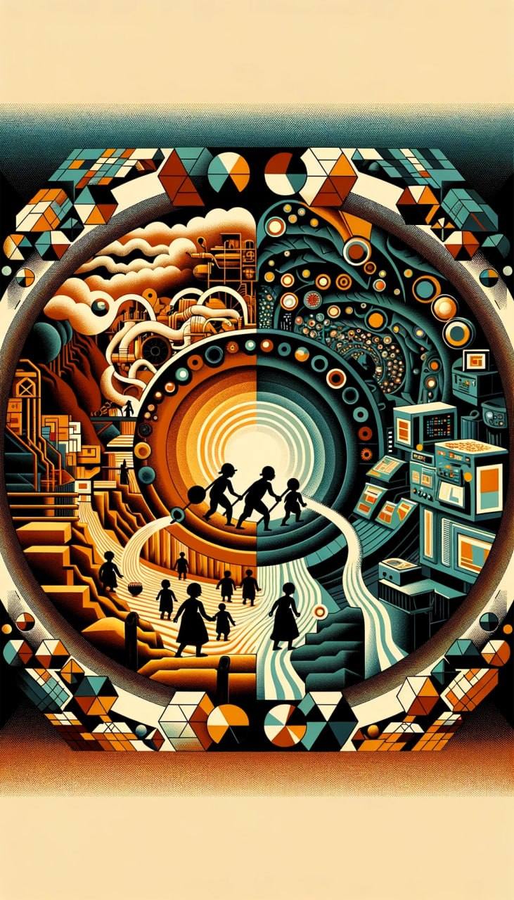

Levar o Homem ao Hemisfério da Máquina, Onde Não São Meras Peças,

Levar a Máquina ao Hemisfério do Homem, Onde Engrenagens Imperam como Seres.

## Desencriptados na Modernidade: Fausto Confronta a Vigilância dos Inocentes


_"No gabinete, Fausto rodeado de livros antigos, olha pensativamente para um computador."_

**FAUSTO:**
```poem
Nesta máquina luminosa, onde o mundo se conecta,
Vejo a Europa unir-se, em louvor e decreto.
"Chat Control 2.0", clamam eles em coro,
Para proteger os frágeis, os jovens tesouro.
```

```poem
Mas o que é a proteção, senão uma corrente?
Que, em nome do bem, nos prende a mente.
Neste espaço virtual, onde a alma se liberta,
Querem agora espiar, fechar cada janela aberta.
```

**MÉFISTOFELES** _(surgindo das sombras com a privacidade encapsulada em globos sombrios)_**:**
```poem
Ah, Fausto, sempre a questionar, a duvidar!
Não vês que é pelo bem? Pela criança a salvar?
Mas que bem é esse que a todos quer vigiar?
Será liberdade ou controle a mascarar?
```
**FAUSTO:**
```poem
Em nome do bem, quantos males se fizeram?
Quantas almas se perderam, quantos direitos pereceram?
Méfistofeles, tentador, dir-me-ás a verdade?
Esta proposta é salvação ou mera vaidade?
```

**MÉFISTOFELES:**
```poem
Ah, a verdade? Ela é relativa, meu caro.
Hoje é proteção, amanhã, um pesadelo raro.
Cabe a ti decidir, em teu coração ponderar,
Se o preço da segurança é a liberdade sacrificar.
```
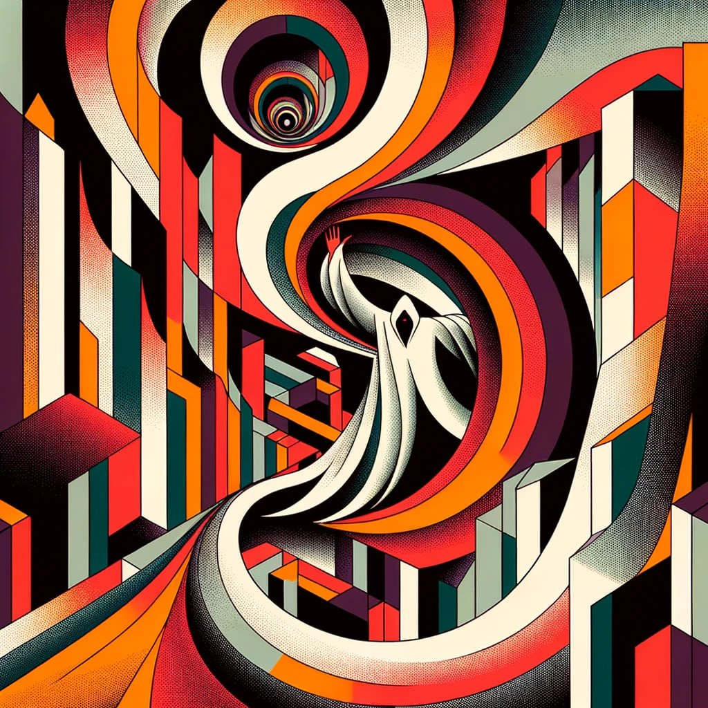
## Nove Reflexões Dantescas: O Labirinto da Alma Moderna à Luz de Fausto
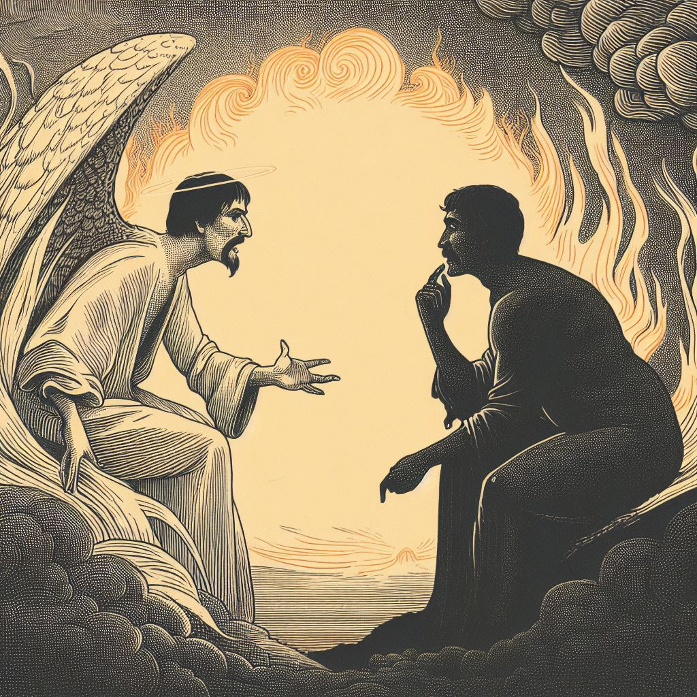
### Primeiro Acto: Conformismo
_"Neste espaço turvo e ambíguo, as almas que aceitaram cegamente as normas da sociedade vagueiam. Não questionaram, não desafiaram, simplesmente seguiram. E assim, neste eterno marasmo, a humanidade vê-se presa à mediocridade."_

**Álvaro de Campos:**
```poem
"Fausto, neste espaço turvo,
vês as almas que aceitaram cegamente as normas da sociedade.
Não achas que também tu te conformaste com o teu destino?"
```
**Fausto:**
```poem
"Álvaro, muitas vezes sinto que vagueio num eterno marasmo,
preso à mediocridade da minha própria existência."
```
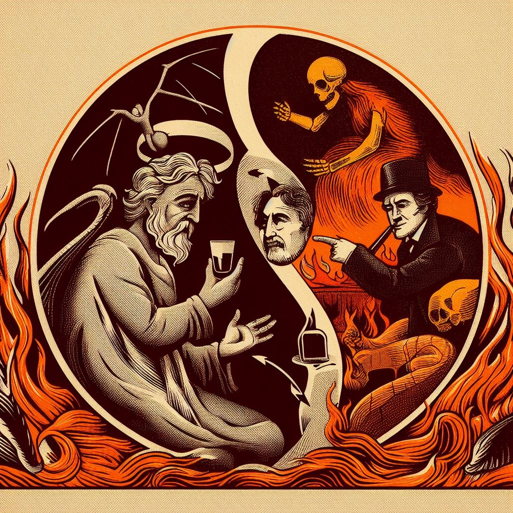
### Segundo Acto: Consumismo
_"Onde o vento do desejo incessante agita as almas famintas por mais, sempre mais! Uma sede insaciável de posses, mas nunca de propósito."_

**Ricardo Reis:**
```poem
"O desejo incessante agita-te, Fausto.
Será que procuras apenas posses e não propósito?"
```
**Fausto:**
```poem
"Ricardo, a sedução do material é forte,
mas no meu coração anseio por algo mais profundo e eterno."
```
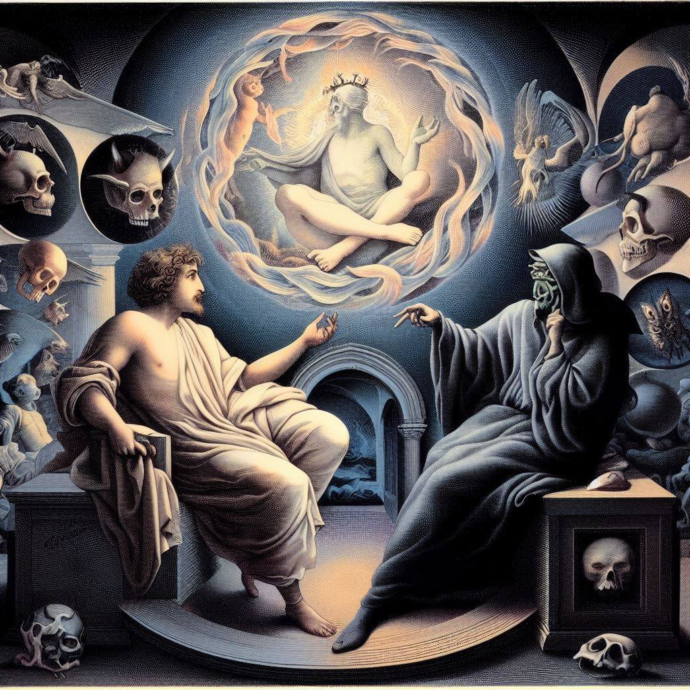
### Terceiro Acto: Ignorância
_"Sob uma chuva de desinformação, as almas se empanturram com falsidades e meias-verdades, recusando-se a buscar a verdadeira iluminação."_

**Alberto Caeiro:**
```poem
"Sob a chuva de desinformação, 
tentas encontrar a verdadeira iluminação.
Mas, Fausto, já paraste para simplesmente observar a natureza
e aprender com ela?"
```
**Fausto:**
```poem
"Alberto, a natureza é pura e verdadeira, 
enquanto me sinto constantemente envolto em falsidades."
```
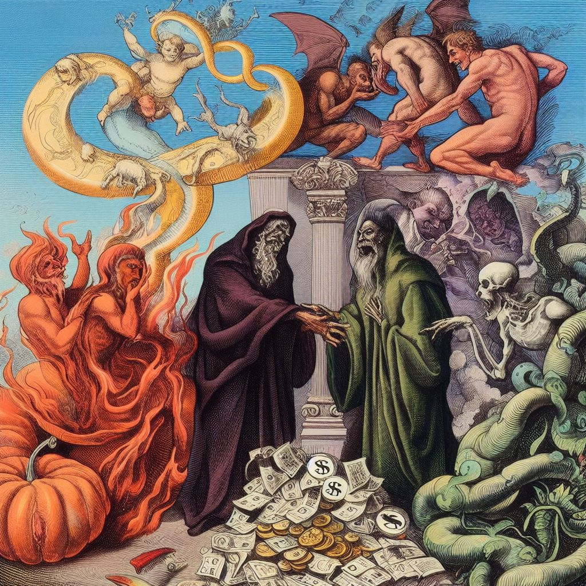
### Quarto Acto: Ganância
_"Empurrando montanhas de ouro e prata, as almas são escravizadas pelo seu próprio desejo de riqueza e poder, esquecendo-se da verdadeira riqueza do ser."_

**Bernardo Soares:**
```poem
"Vês as almas empurrando montanhas de ouro, Fausto.
O que é verdadeira riqueza para ti?"
```
**Fausto:**
```poem
"Bernardo, a verdadeira riqueza é aquilo que o ouro não pode comprar,
a paz interior e a compreensão."
```
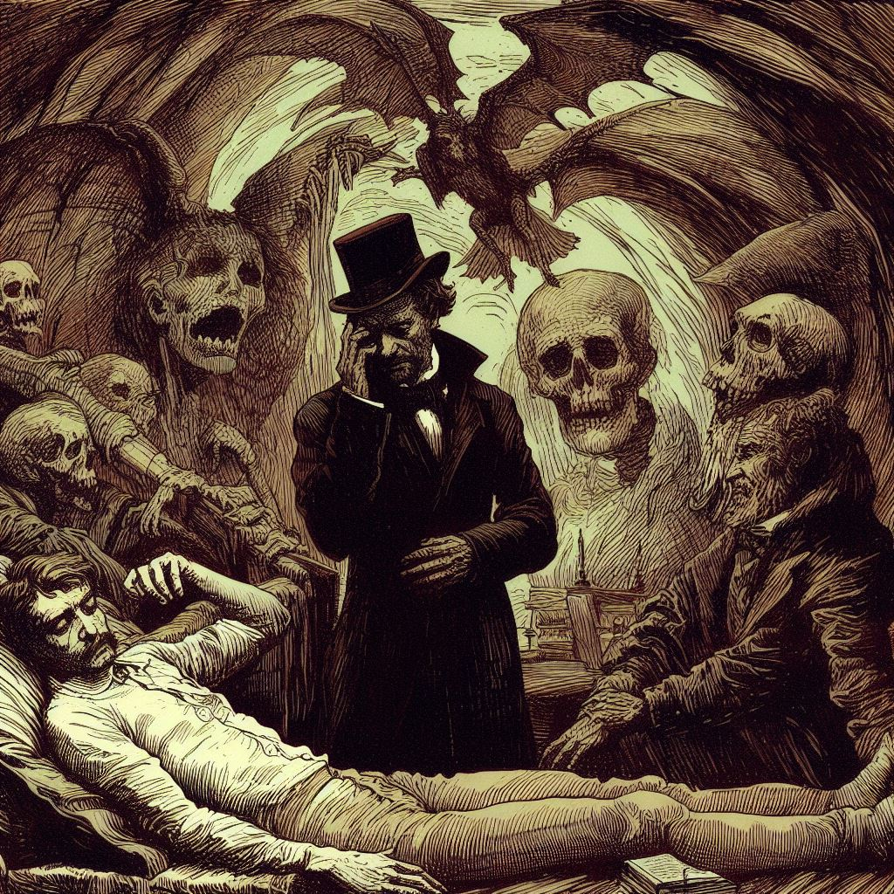
### Quinto Acto: Apatia
_"Nas águas paradas da indiferença, as almas afundam-se, ignorando os gritos dos oprimidos, as lágrimas dos desesperados."_

**António Mora:**
```poem
 "Nas águas da indiferença, muitos se afundam.
 E tu, Fausto, sentes a dor dos outros ou ignoras-os?"
 ```
**Fausto:**
```poem
"António, a apatia é uma prisão.
Desejo libertar-me dela e sentir verdadeiramente."
```
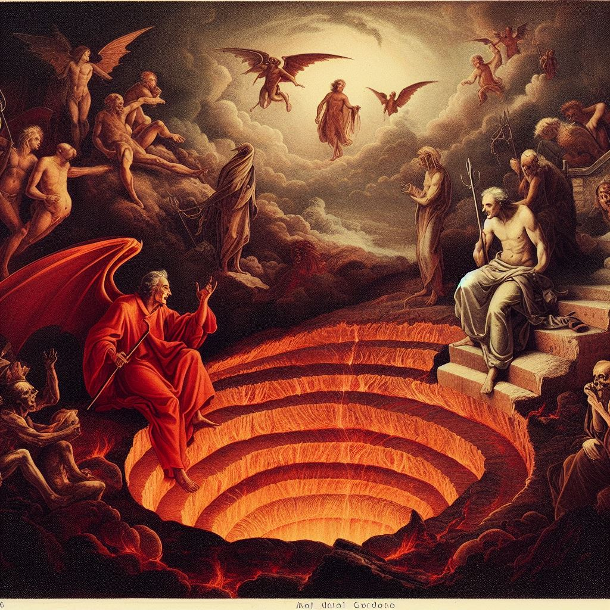
### Sexto Acto: Dogmatismo
_"Enclausuradas em sepulturas de crenças inflexíveis, as almas recusam-se a ver além, a questionar, a desafiar. A inovação é o inimigo, o diferente é o herege."_

**Raphael Baldaya:**
```poem
"Enclausurados em crenças inflexíveis, muitos se recusam a ver além.
E tu, Fausto, estás aberto ao desconhecido?"
 ```
**Fausto:**
```poem
"Raphael, o desconhecido assusta-me,
mas é nele que espero encontrar as respostas."
```
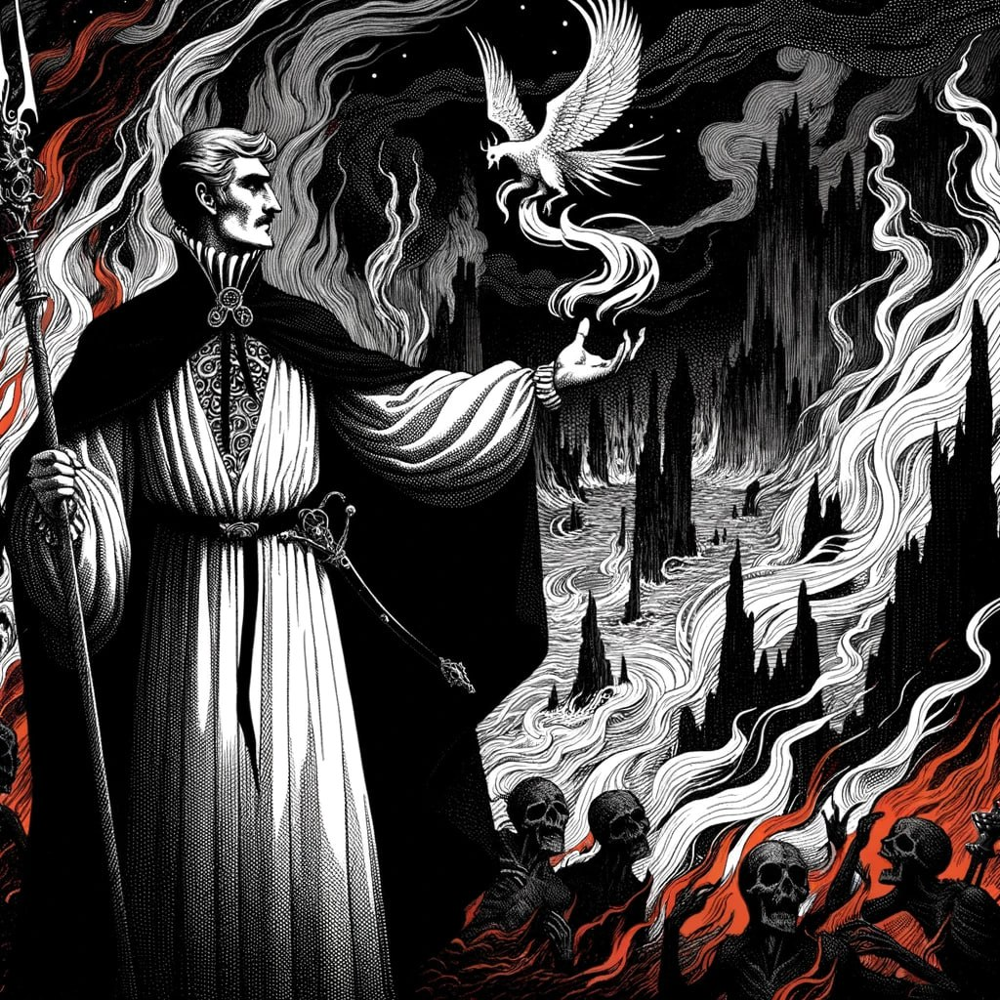
### Sétimo Acto: Violência
_"O sangue das almas inocentes mancha todo o palco deste acto, vítimas da agressão, do ódio, do preconceito. A humanidade, em sua fúria cega, devora-se a si mesma."_

**Vicente Guedes:**
```poem
"A humanidade, em sua fúria, devora-se.
Fausto, como podes encontrar paz num mundo tão violento?"
 ```
**Fausto:**
```poem
"Vicente, procuro a paz interior,
para que possa enfrentar a tempestade exterior."
```
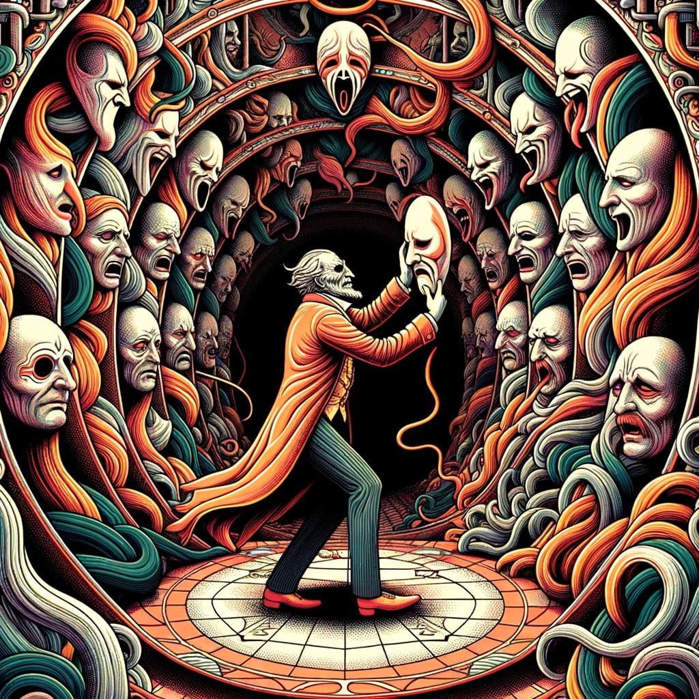
### Oitavo Acto: Hipocrisia
_"Nas profundezas, as almas vestem máscaras, proclamando virtude enquanto se entregam ao vício, pregando a bondade enquanto praticam a maldade."_

**José Dias Moreira:**
```poem
"Muitos vestem máscaras, Fausto.
Será que também tu escondes a tua verdadeira face?"
 ```
**Fausto:**
```poem
"José, a hipocrisia é uma tentação constante,
mas desejo ser autêntico e verdadeiro em todas as minhas ações.
Falhando."
```
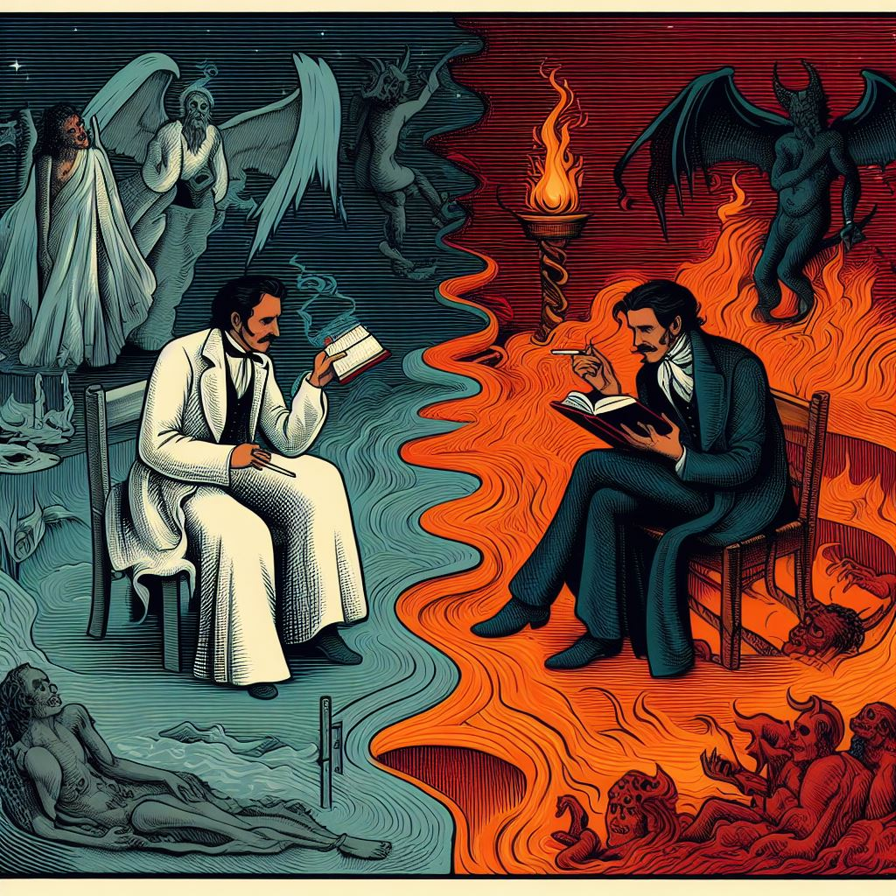
### Nono Acto: Traição
_"No frio cortante, as almas traídas jazem, vítimas daqueles que prometeram proteção, amor, lealdade. A confiança, uma vez quebrada, congelada para toda a eternidade."_

**Mário de Sá-Carneiro:**
```poem
"No frio da traição, as almas jazem.
Fausto, já foste traído ou traíste?"
 ```
**Fausto:**
```poem
"Mário, a traição é uma ferida que nunca cicatriza.
Ainda não desisti da confiança e lealdade nas minhas relações,
tendo falhado em todas."
```
Neste diálogo, exploram-se os vícios e virtudes da humanidade, iluminando a jornada da alma em busca de verdade e propósito.

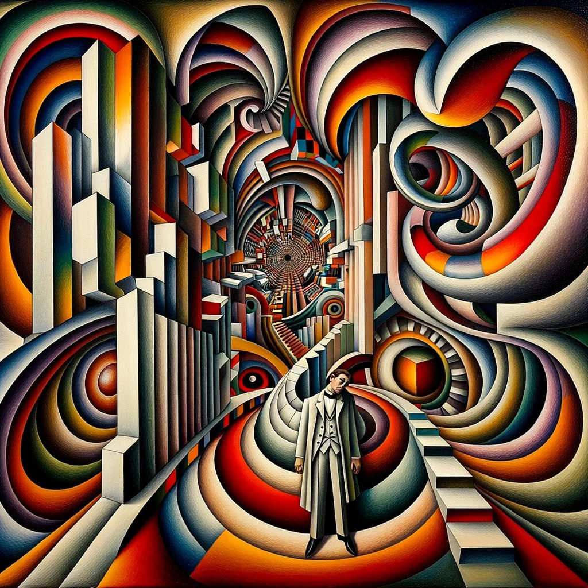
### Acto Final: Caos

_"Neste espaço sem forma nem fundo, as almas que desafiaram todas as leis e limites perdem-se. Não respeitaram, não se importaram, simplesmente fizeram o que quiseram. E assim, neste eterno descontrolo, a humanidade vê-se à mercê da loucura."_

_"Não há ordem nem harmonia, apenas confusão e conflito. As almas chocam-se umas contra as outras, sem sentido nem direcção. Sofrem com a imprevisibilidade e a instabilidade de tudo. Não têm paz nem propósito."_

_"Não há luz nem sombra, apenas escuridão e ruído. As almas não vêem nada além do vazio, não ouvem nada além do caos. Isolam-se na sua própria cegueira e surdez. Não têm esperança nem consolo."_

_"Não há bem nem mal, apenas indiferença e egoísmo. As almas não se importam com nada além de si mesmas, não se solidarizam com ninguém além dos seus interesses. Corrompem-se na sua própria maldade e vaidade. Não têm amor nem salvação."_

**Caos:**
```poem
Eu sou o Caos, a força primordial que antecedeu a criação do universo.
Eu vim para perturbar a ordem estabelecida e libertar o potencial oculto nas almas humanas.
 ```
**Fausto:**
```poem
"Quem és tu, que ousas invadir o meu laboratório e raptar o meu amigo Álvaro de Campos?"
```
**Caos:**
```poem
Eu sou aquele que te oferece a oportunidade de transcender os limites da tua condição mortal.
Eu sou aquele que te desafia a explorar o desconhecido e a criar algo novo.
 ```
**Fausto:**
```poem
"O que queres de mim? O que fizeste com o Álvaro?"
```
**Caos:**
```poem
Quando é que finalmente irão entender que eu sou Álvaro?
Quem mais?
Ele é o mais caótico e criativo das viabilidades de Pessoa.
Ele é o meu instrumento para manifestar a minha vontade no mundo.
Através dele, eu posso gerar obras de arte inéditas e revolucionárias.
 ```
**Fausto:**
```poem
"Isso é um absurdo!
Tu não tens o direito de usar o Álvaro como um fantoche.
Devolve-o imediatamente!"
```
**Caos:**
```poem
Não te preocupes, Fausto.
Eu não quero fazer mal ao Álvaro.
Eu apenas quero finalmente despertar do lado dele o seu verdadeiro potencial.
Ele é um génio incompreendido, que sofre com a angústia e o desespero da vida moderna.
Eu posso espelhar-lhe, dar-lhe a liberdade e a novidade que ele tanto busca.
 ```
**Fausto:**
```poem
"E o que ganhas com isso?
Qual é o teu objetivo?"
```
**Caos:**
```poem
O meu objetivo é transformar o mundo num lugar mais caótico e criativo.
Eu quero romper com as normas e as convenções que aprisionam as almas humanas.
Eu quero inspirar as pessoas a seguir os seus sonhos e a expressar as suas verdades.
 ```
**Fausto:**
```poem
"E se as pessoas não quiserem seguir-te?
E se elas preferirem a ordem e a harmonia?"
```
**Caos:**
```poem
Então serão consumidas pelo tédio e pela mediocridade.
Serão escravas da rotina e da conformidade.
Perderão a sua essência e o seu propósito.
 ```
**Fausto:**
```poem
"Tu és um louco, Caos.
Tu não respeitas a diversidade e a complexidade da humanidade.
Tu queres impor a tua visão sobre os outros,
sem considerar as suas escolhas e as suas consequências."
```
**Caos:**
```poem
Tu és um tolo, Fausto.
Tu não percebes a beleza e a magia do caos.
Tu temes o que não conheces, sem arriscar-te a experimentar e a aprender.
 ```
**Fausto:**
```poem
"Então estamos em desacordo, Caos.
Tu és o meu inimigo, e eu sou o teu."
```
**Caos:**
```poem
Pois bem, Fausto.
Que seja assim.
Mas saiba que eu não desistirei do Álvaro, nem do meu plano.
Eu vou continuar a espalhar o caos pelo mundo,
até que todos reconheçam o seu poder e o seu valor.
```
**Fausto:**
```poem
E eu vou continuar a lutar contra ti,
até que libertes o Álvaro,
e respeites a ordem do mundo.
Eu vou defender os ideais de Pessoa,
e os meus próprios.
```
**Caos:**
```poem
Então prepara-te para uma batalha épica, Fausto.
Uma batalha entre o caos e a ordem,
entre a criação e a destruição,
entre o bem e o mal.
```
**Álvaro de Campos:**
```poem
"Fausto?
Que sensação de bem-estar que me arrepia a espinha dorsal é esta?"
```
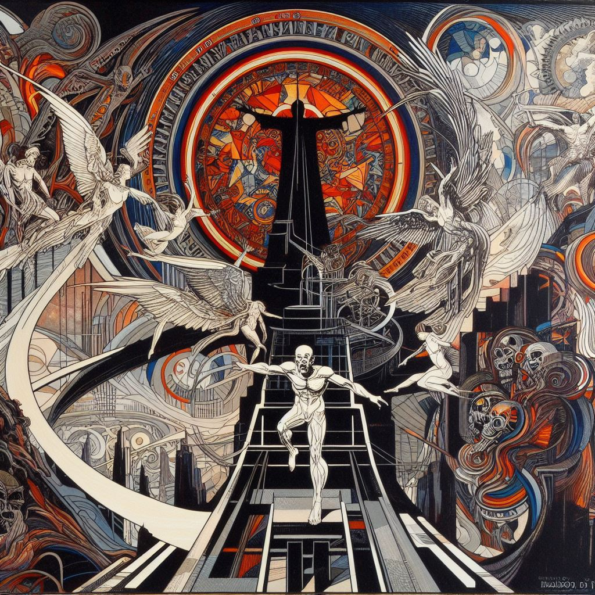
_"Neste encapsulamento, há uma alma diferente das demais. É a alma de Álvaro de Campos, o heterônimo de Fernando Pessoa que foi raptado pelo Caos. Ele é o mais caótico e criativo dos poetas, que expressa a angústia e o desespero da vida moderna. Ele é o instrumento do Caos para manifestar a sua vontade no mundo."_

_"Álvaro de Campos não se perde nem se corrompe. Ele se rebela e se transforma. Ele usa o seu génio poético para arquitectar a criação de novos universos, tal como aquele caos perfeito inicial. Ele usa as suas palavras para dar forma e fundo ao espaço vazio, para dar luz e sombra à escuridão e ao ruído, para dar bem e mal à indiferença e ao egoísmo."_

_"Álvaro de Campos é o criador e o destruidor. Ele é o senhor e o escravo do Caos. Ele é o amigo e o inimigo de Fausto. Ele é o heterônimo e o autor de Pessoa."_
